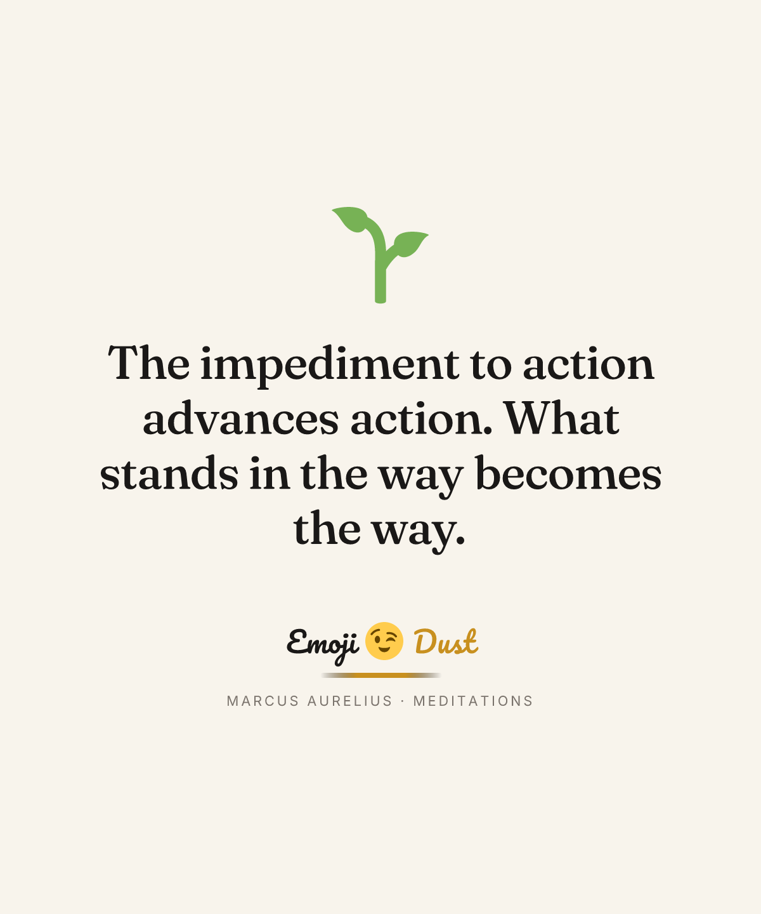

# EMOJI DUST

> Wisdom delivered with a wink. Quote-led apparel and homeware, printed in the UK and EU.

EMOJI DUST is a print-on-demand quote brand. We curate quotes from public-domain
figures (Stoics, Wilde, Twain, Rumi…) and write our own aphorisms in EMOJI DUST
voice, render each as typography-led artwork, and turn them into tees, tank
tops, hoodies and mugs through Printify. Purchasing, dispatch and delivery are
handled by Printify; this Next.js app is the brand-led storefront customers
browse before clicking through to the Printify Pop-Up listing.

[](https://github.com/findgriff/emoji-dust)

---

## How this is built

| Layer | Choice |
|---|---|
| Framework | Next.js 15 (App Router, RSC) |
| Language | TypeScript strict |
| Styling | Tailwind 3 + custom brand tokens |
| Image rendering | [Satori](https://github.com/vercel/satori) + [@resvg/resvg-js](https://github.com/yisibl/resvg-js) — every design is server-rendered SVG → PNG from JSX |
| Emoji rendering | [Twemoji 14](https://github.com/twitter/twemoji) — consistent across every OS |
| Fonts | Fraunces (display serif), Inter (body), Pacifico (logo script) — all OFL, bundled via `@fontsource` |
| Print | Printify v1 API ([client](src/lib/printify/client.ts), [sync](src/lib/printify/sync.ts)) |
| Hosting target | Vercel (deferred until shop credentials provisioned) |
| Database | Drizzle + Postgres on Neon (deferred — content lives in `src/content/` TypeScript modules until then) |

The full architecture is documented in [docs/superpowers/specs/2026-05-09-emoji-dust-north-star-design.md](docs/superpowers/specs/2026-05-09-emoji-dust-north-star-design.md).

## What's in this repo

```
emoji-dust/
├── src/
│   ├── app/                       # Next.js routes
│   │   ├── page.tsx               # landing
│   │   ├── shop/                  # browse by kind
│   │   ├── p/[slug]/              # product detail
│   │   ├── figures/               # all figures + per-figure pages
│   │   └── about/
│   ├── components/                # site chrome + product card
│   ├── content/                   # the catalogue (in-memory until DB ships)
│   │   ├── figures.ts             # 20 public-domain figures
│   │   ├── quotes.ts              # 30 attributed + 20 aphorism = 50 quotes
│   │   ├── catalog.ts             # blueprint × provider × pricing per product kind
│   │   └── products.ts            # materialises 200 SKUs (50 quotes × 4 kinds)
│   ├── design/
│   │   ├── render.ts              # Satori → Resvg pipeline
│   │   └── templates/
│   │       └── minimal-serif.tsx  # the only template at MVP
│   └── lib/
│       └── printify/
│           ├── client.ts          # thin API wrapper
│           └── sync.ts            # quote → upload → product → publish
├── scripts/
│   ├── render-designs.ts          # render all/one design to public/designs/*.png
│   └── sync-printify.ts           # push products to Printify (needs Pop-Up shop)
├── public/
│   └── designs/                   # 50 rendered PNGs, one per quote
├── brand/
│   └── emoji-dust-logo.jpeg       # vectorise to SVG before launch
├── docs/superpowers/specs/        # architecture spec
├── HANDOVER.md                    # status note for next session
└── .env.local                     # secrets (gitignored)
```

## Run it locally

Requires Node 20+ and pnpm 8+.

```bash
git clone git@github.com:findgriff/emoji-dust.git
cd emoji-dust
pnpm install              # also installs @fontsource/* (fonts come bundled)
pnpm render:designs       # render all 50 quotes → public/designs/
pnpm dev                  # http://localhost:3000
```

That's it — the storefront is fully populated locally with 200 SKUs across 50
quotes × 4 product kinds. Buy buttons show "Coming soon · syncing to Printify"
until the Printify sync runs (see below).

### Other scripts

```bash
pnpm typecheck                                   # tsc --noEmit, must be clean
pnpm render:designs aurelius-impediment          # render one quote only
pnpm render:designs                              # render the full catalogue
pnpm sync:printify                               # dry-run, lists planned creates
pnpm sync:printify --commit                      # push everything to Printify
pnpm sync:printify --commit --kind tee           # one product kind at a time
```

## Going live

The site runs locally without any external services. To go fully live, three
things need provisioning — all owner actions:

1. **Create a Printify Pop-Up Store** at https://printify.com/app/stores
   (the existing "Fashion Kudos" shop is on Etsy and won't work for our custom
   storefront flow). Capture its `shop_id` into `.env.local` as
   `PRINTIFY_SHOP_ID=...`.

2. **Run the Printify sync** — uploads each rendered PNG to Printify, creates a
   product per quote × kind, and captures the Pop-Up listing URL into the
   product record. Populates the Buy CTAs.
   ```bash
   pnpm sync:printify --commit
   ```

3. **Deploy.** A Vercel project pointed at this repo + the env vars in
   `.env.local`. Deferred to the Foundations sub-project — see the spec for the
   full plan.

## Adding more content

### A new figure
Append to `src/content/figures.ts`. Slug must be unique. Source URL should be
the canonical Wikiquote/Wikipedia page.

### A new quote
Append to `src/content/quotes.ts`. Set `kind: 'attributed'` with `figure_slug`
for real quotes; `kind: 'aphorism'` for EMOJI DUST originals. Then:
```bash
pnpm render:designs <quote-id>
```
The product list (`PRODUCTS`) regenerates automatically across all 4 kinds.

### A new template
Add a JSX file under `src/design/templates/`, register it in
`render.ts`, and add an entry in the catalog if it should be used by default.

## What's intentionally not here yet

- **Database** — content lives in TypeScript modules. The Drizzle Postgres
  schema is defined in the spec but not yet implemented. Foundations
  sub-project does this.
- **Admin panel** — quote/design/product approval queues. Sub-project #4.
- **Multiple templates** — only `minimal-serif-v1` ships at MVP. Sub-project #2
  adds `split-emoji-v1` and `stacked-cap-v1`.
- **Inngest jobs** — for now `pnpm render:designs` and `pnpm sync:printify` are
  manual. Sub-project #3 wires them up.
- **Stripe / customer accounts / order management** — never. Printify
  Pop-Up handles all of this. See spec §Q6.

## Brand summary

- **Tone:** playful-premium hybrid — winking philosopher, not solemn
- **Palette:** ink charcoal `#1A1817`, cream `#F8F4EC`, dust gold `#E8B23E`,
  sparkle `#FFD86B`, deep plum `#3A1E32`
- **Type:** Fraunces (display) + Inter (UI) + Pacifico (logo script)
- **Print:** UK (T Shirt and Sons, Westbury) for apparel, EU (OPT OnDemand,
  Prague) for mugs
- **Quote rule:** attributed quotes only from figures whose work is in the
  public domain in the UK (life + 70). All translation rights cleared the
  same way. Originals signed by EMOJI DUST.

## Licence

Application code: MIT (see `LICENSE`). Logo + brand identity: © EMOJI DUST,
all rights reserved. Quote artwork: typography is OFL-licensed (Fraunces,
Inter, Pacifico); emoji glyphs are Twemoji 14 (CC-BY 4.0); rendered designs
are © EMOJI DUST.

---

*Built with care, printed in Europe, signed with a wink.* ✨
